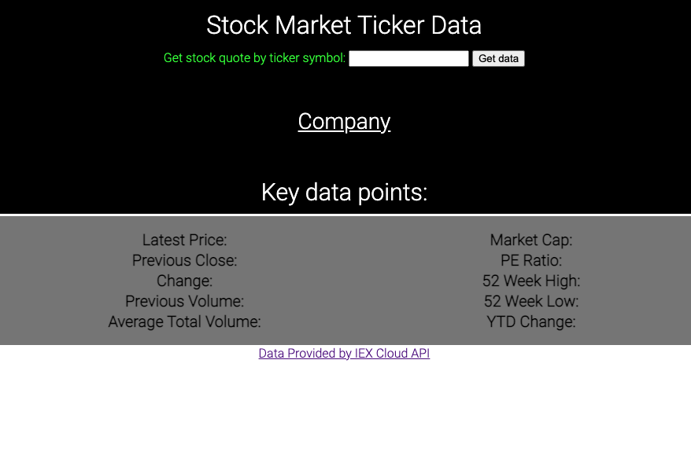
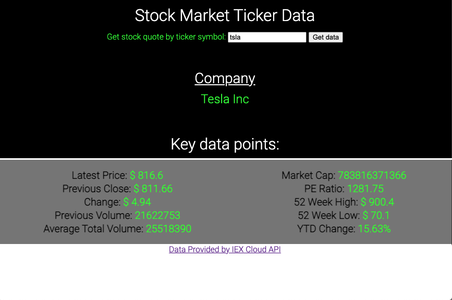

# Stock Market Ticker App

https://stocktickerquotes.netlify.app/

## Description

This is a stock market ticker quote app that uses the IEX Cloud API to pull current key data for a user inputted stock ticker. This is all made using HTML, CSS, and Javascript. It's a simple app demonstrating working knowledge of pulling data from API's. I hope to expand on this project by using the AMChart software to create a graph using historical data from the IEX Cloud API; allowing the user to have visualized interactive data points for the stock ticker of their choice. It was a lot of fun setting this app and researching different API's and how to use them, getting into the nitty gritty of the documentation. This was also a useful exercise in reacquanting myself with CSS Grid to create a simple neat layout. 

### 

This app uses a hidden API Key to function

## Screenshot

